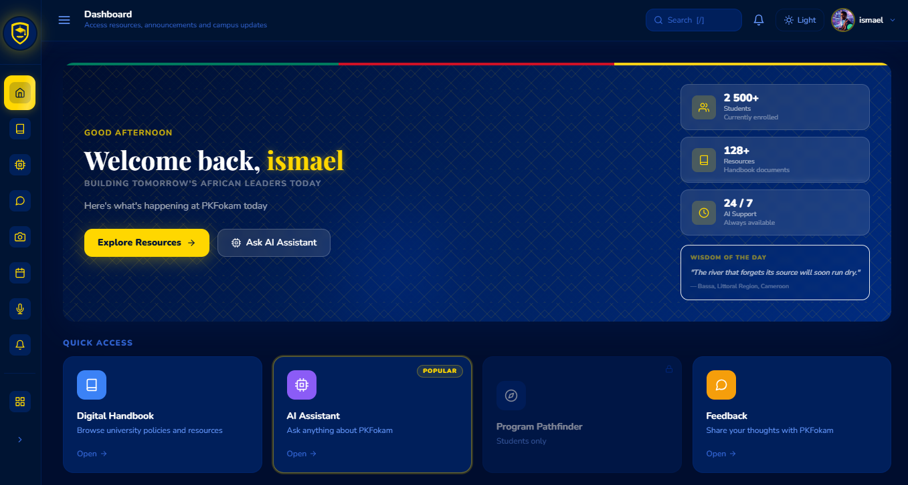

# PKFIE-Hub — AI-Powered Student Information Portal



> An intelligent campus gateway for [PKFokam Institute of Excellence](https://pkfokam.edu.cm) that combines a role-based student portal, AI-powered chat assistant, and a full-featured admin panel — built with React 19 and Django 5.2.

**Live:** [pkfie-hub.vercel.app](https://pkfie-hub.vercel.app) · **API:** [pkfie-hub-production.up.railway.app](https://pkfie-hub-production.up.railway.app)

---

## What it does

PKFIE-Hub replaces the fragmented, paper-based information flow at PKFokam with a single platform. Students, parents, and lecturers log in to one place to find documents, announcements, events, and career guidance. Administrators manage everything through a dedicated panel. An embedded AI assistant — powered by Anthropic Claude with an OpenAI fallback — answers campus-specific questions grounded in uploaded institutional documents.

---

## Architecture

```
┌─────────────────────────────────────────────────────────┐
│                        Browser                          │
│                                                         │
│  React 19 · React Router 7 · Tailwind CSS · Axios      │
│                                                         │
│  ┌─────────────────┐      ┌────────────────────────┐   │
│  │  Student Portal  │      │      Admin Panel       │   │
│  │  Dashboard       │      │  User Management       │   │
│  │  AI Assistant    │      │  Announcement/Events   │   │
│  │  Calendar        │      │  Feedback/Notifs       │   │
│  │  Pathfinder Quiz │      │  AI Model Config       │   │
│  │  Handbook        │      │  System Settings       │   │
│  │  Innovation      │      │  Analytics             │   │
│  └────────┬─────────┘      └──────────┬─────────────┘   │
└───────────┼──────────────────────────┼─────────────────┘
            │  Access token (memory)   │
            │  Refresh token (cookie)  │
            ▼                          ▼
┌─────────────────────────────────────────────────────────┐
│              Django REST Framework API                   │
│              (16 apps · IsAuthenticated default)        │
│                                                         │
│  ┌──────────┐  ┌──────────┐  ┌──────────┐             │
│  │  users   │  │  chat    │  │documents │             │
│  │  JWT auth│  │  AI msgs │  │  RAG     │             │
│  └──────────┘  └──────────┘  └──────────┘             │
│  ┌──────────┐  ┌──────────┐  ┌──────────┐             │
│  │announce- │  │ events   │  │pathfinder│             │
│  │ments     │  │ feedback │  │ handbook │             │
│  └──────────┘  └──────────┘  └──────────┘             │
│  ┌──────────┐  ┌──────────┐  ┌──────────┐             │
│  │innovation│  │ gallery  │  │  system  │             │
│  │analytics │  │calendar  │  │ai_training│            │
│  └──────────┘  └──────────┘  └──────────┘             │
└─────────────────────────┬───────────────────────────────┘
                          │
          ┌───────────────┼───────────────┐
          ▼               ▼               ▼
     PostgreSQL        ChromaDB       Anthropic /
    (Railway)        (RAG vectors)   OpenAI API
```

---

## Feature overview

### Student / Parent / Lecturer portal

| Feature | Description |
|---|---|
| **AI Chat Assistant** | Ask campus-specific questions. Claude reads institutional documents via RAG to give grounded answers. |
| **Pathfinder Quiz** | Step-by-step career and program recommendation wizard based on interests and aptitudes. |
| **Announcements** | Live feed of campus announcements filterable by priority (low / normal / high / urgent). |
| **Calendar** | Unified view of personal and campus events. Day, week, and month views with a live "now" indicator. |
| **Handbook** | Structured student handbook with sections and content blocks. |
| **Innovation Hub** | Showcase of student innovation projects, challenges, and community members. |
| **Gallery** | Photo and video gallery organized by occasion. |
| **Feedback** | Submit feedback with file attachments and priority levels. |
| **Notifications** | Notification centre with type filtering and mark-all-read. |
| **Settings** | Update profile, preferences, and account details. |

### Admin panel

| Feature | Description |
|---|---|
| **User Management** | Create, search, filter, and manage all accounts across all roles. |
| **Announcement Management** | Full CRUD with priority, audience targeting, and viewer analytics. |
| **Event Management** | 7 event types (seminar, workshop, webinar, conference, hackathon, cultural, competition) with registration links and attendee tracking. |
| **Feedback Management** | View and respond to student feedback. Bulk actions, priority/category filters, attachment downloads. |
| **Notifications** | Send and manage platform notifications. Mark all read. Server-side search and type filtering. |
| **AI Model Management** | Configure Anthropic/OpenAI model parameters (temperature, max tokens, top-p, Claude variant). Live test prompt with latency display. |
| **Document Management** | Upload institutional documents that feed the AI assistant's RAG pipeline. |
| **System Settings** | Key/value settings grouped by category (General, AI, File, Email). Change tracking with unsaved-changes guard. |
| **Analytics** | Admin action logs, audit trails, and usage statistics. |

---

## Technology stack

### Frontend
- **React 19** with React Router 7
- **Tailwind CSS** (custom navy/gold PKFokam palette)
- **Axios** with in-memory access token, automatic silent refresh, and 401 logout
- **Chart.js / Recharts** for analytics dashboards
- **react-icons** (Feather set)

### Backend
- **Django 5.2** + **Django REST Framework 3.16**
- **SimpleJWT** — short-lived access tokens (15 min) + rotating httpOnly refresh tokens (7 days)
- **django-cors-headers** — CORS locked to specific origins
- **Anthropic SDK** (primary AI provider) + **OpenAI SDK** (fallback)
- **ChromaDB** — vector store for RAG document retrieval
- **PyPDF2 / python-docx** — document parsing pipeline
- **SQLite** (development) / **PostgreSQL** (production via `dj-database-url`)

### Infrastructure
- **Vercel** — React frontend (auto-deploys on push to `main`)
- **Railway** — Django backend + PostgreSQL (auto-deploys on push to `main`)
- **GitHub Actions** — CI: 261 Django tests + React build check on every push

---

## Authentication & access control

JWT-based authentication with two token tiers:

- **Access token** (15 min) — stored in JavaScript memory only, never in localStorage or cookies. Sent as `Authorization: Bearer` header.
- **Refresh token** (7 days) — stored in an `httpOnly; SameSite=None; Secure` cookie. Never accessible to JavaScript. Rotated and blacklisted on every use.

On page load the app silently calls `/api/auth/token-refresh/`. If the cookie is valid, the user is restored without seeing the login screen. If not, the login page is shown.

Role-based access is enforced server-side on every endpoint — frontend guards are a UX layer only:

| Role | Access |
|---|---|
| `student` | Student portal (all features) |
| `parent` | Student portal (read-heavy) |
| `lecturer` | Student portal + course-related write access |
| `admin` | Full admin panel + all write endpoints |

Key enforcement points:
- AI model config, system settings, and user management require `IsAdminUser`
- Feedback submissions are readable only by the submitter or an admin
- Conversations and notifications are scoped to the requesting user

---

## Security

| Area | Implementation |
|---|---|
| **XSS protection** | Access token in memory only; refresh token in httpOnly cookie — neither is reachable by injected scripts |
| **Token theft mitigation** | Refresh token rotation + blacklisting (`token_blacklist` app); a stolen token can only be used once |
| **Brute-force protection** | DRF throttling: 5 login attempts/min, 10 registrations/min, 60 general anon requests/min |
| **Role restriction** | Self-registration locked to `student` and `parent` roles; `admin` and `lecturer` accounts created by admins only |
| **Secret management** | All secrets in `.env` (gitignored); `SECRET_KEY` crashes at startup if missing in production |
| **HTTPS enforcement** | `SECURE_SSL_REDIRECT`, HSTS (1 year, preload), secure cookies — all active in production |
| **CORS** | Locked to `localhost:3000` in development, Vercel URL in production — never `allow_all` |
| **Data isolation** | All querysets filtered by `user=request.user` at the API level |
| **Input validation** | All writes pass through DRF serializer validation; client-side validation is additive only |

---

## Getting started

### Prerequisites

- Python 3.10+
- Node.js 18+
- An [Anthropic API key](https://console.anthropic.com/) — or an OpenAI key as fallback
- A Gmail [App Password](https://myaccount.google.com/apppasswords) for outgoing email (optional)

### 1. Clone the repo

```bash
git clone https://github.com/letschangeAfrica/pkfie-hub.git
cd pkfie-hub
```

### 2. Backend setup

```bash
cd pkfehub_backend

# Create and activate a virtual environment
python -m venv venv
source venv/bin/activate        # Windows: venv\Scripts\activate

# Install dependencies
pip install -r requirements.txt

# Create your environment file
cp .env.example .env            # then fill in real values
```

Edit `pkfehub_backend/.env`:

```env
SECRET_KEY=replace-with-a-long-random-string
DEBUG=True
DJANGO_ALLOWED_HOSTS=localhost,127.0.0.1

# AI — at least one key required for the chat assistant
ANTHROPIC_API_KEY=sk-ant-...
# OPENAI_API_KEY=sk-...

# Email (optional — for password reset and notifications)
EMAIL_HOST=smtp.gmail.com
EMAIL_PORT=587
EMAIL_USE_TLS=True
EMAIL_HOST_USER=you@gmail.com
EMAIL_HOST_PASSWORD=your-gmail-app-password
DEFAULT_FROM_EMAIL=PKFIE-Hub <you@gmail.com>
```

```bash
# Run migrations
python manage.py migrate

# Create an admin account
python manage.py createsuperuser

# (Optional) Seed Pathfinder quiz data
python manage.py seed_pathfinder

# Start the API server
python manage.py runserver
```

### 3. Frontend setup

```bash
# From the repo root
npm install
npm start
```

The app opens at `http://localhost:3000`. Log in with the superuser credentials you just created — the admin panel is at `/admin`.

### 4. Run both together

```bash
# From the repo root
npm run dev
```

---

## Project structure

```
pkfie-hub/
├── pkfehub_backend/          # Django backend
│   ├── users/                # Custom user model (email-based), JWT auth, throttling
│   ├── chat/                 # AI assistant, conversations, AIModel config
│   ├── documents/            # Document storage + RAG pipeline
│   ├── announcements/        # Campus announcements with viewer tracking
│   ├── events/               # Campus events with attendee management
│   ├── feedback/             # Feedback submissions, categories, responses
│   ├── notifications/        # Per-user notifications
│   ├── pathfinder/           # Career/program recommendation quiz engine
│   ├── handbook/             # Structured student handbook
│   ├── innovation/           # Innovation projects and challenges
│   ├── gallery/              # Media gallery by occasion
│   ├── calendar_app/         # Unified calendar events
│   ├── analytics/            # Audit logs, usage stats, admin action tracking
│   ├── ai_training/          # RAG training pipeline (ChromaDB)
│   ├── system/               # System-wide settings (key/value store)
│   ├── Dockerfile            # Production image (migrate + createsuperuser + gunicorn)
│   └── pkfehub_backend/      # Django project settings and root URLs
│
├── src/                      # React frontend
│   ├── pages/
│   │   ├── admin/            # Admin panel (10 pages)
│   │   └── main/             # Student/lecturer portal (13 pages)
│   ├── components/           # Shared layout and UI components
│   ├── contexts/             # AuthContext (session restore, login, logout)
│   └── services/
│       └── api.js            # Axios instance — memory token, silent refresh, 401 handling
│
└── .github/workflows/ci.yml  # GitHub Actions CI (Django tests + React build)
```

---

## Environment variables reference

### Backend (`pkfehub_backend/.env`)

| Variable | Required | Description |
|---|---|---|
| `SECRET_KEY` | Yes | Django secret key — crashes at startup if missing in production |
| `DEBUG` | No | `True` for development; always `False` in production |
| `DJANGO_ALLOWED_HOSTS` | Yes | Comma-separated allowed hostnames (include your Railway domain) |
| `CORS_ALLOWED_ORIGINS` | Yes (prod) | Comma-separated frontend URLs (e.g. `https://pkfie-hub.vercel.app`) |
| `ANTHROPIC_API_KEY` | Yes* | Powers the AI assistant (primary provider) |
| `OPENAI_API_KEY` | Yes* | AI fallback if Anthropic key is absent |
| `DATABASE_URL` | No | PostgreSQL URL; defaults to SQLite if absent |
| `EMAIL_HOST_USER` | No | Gmail address for outgoing email |
| `EMAIL_HOST_PASSWORD` | No | Gmail App Password (not your account password) |

\* At least one AI key is required for the chat assistant to function.

### Frontend (Vercel environment variables)

| Variable | Required | Description |
|---|---|---|
| `REACT_APP_BACKEND_URL` | Yes (prod) | Full Railway backend URL, e.g. `https://pkfie-hub-production.up.railway.app` |

---

## Deployment (Railway + Vercel)

### Backend — Railway

1. Create a new Railway project, add a **Python** service pointing to this repo, and add a **PostgreSQL** plugin.
2. Set the root directory to `pkfehub_backend` and the watch path to `pkfehub_backend`.
3. Railway uses the `Dockerfile` automatically. On every deploy it runs:
   - `python manage.py migrate`
   - `python manage.py createsuperuser --no-input` (skipped silently if account already exists)
   - `gunicorn pkfehub_backend.wsgi:application`
4. Add these environment variables in Railway → Variables:

```
SECRET_KEY=<long random string>
DEBUG=False
DJANGO_ALLOWED_HOSTS=<your-app>.up.railway.app,localhost
CORS_ALLOWED_ORIGINS=https://<your-app>.vercel.app
ANTHROPIC_API_KEY=sk-ant-...
DJANGO_SUPERUSER_EMAIL=admin@pkfokam.edu
DJANGO_SUPERUSER_PASSWORD=<secure password>
DJANGO_SUPERUSER_FIRST_NAME=Admin
DJANGO_SUPERUSER_LAST_NAME=PKFokam
```

5. Generate a public domain in Railway → Networking → Generate Domain (port 8000).

### Frontend — Vercel

1. Import the repo into Vercel. Set the **root directory** to `/` (repo root).
2. Framework preset: **Create React App**.
3. Add this environment variable in Vercel → Settings → Environment Variables:

```
REACT_APP_BACKEND_URL=https://<your-app>.up.railway.app
```

4. Deploy. Vercel auto-deploys on every push to `main`.

---

## CI/CD

GitHub Actions runs on every push and pull request:

- **Backend job**: installs Python 3.10, runs all 261 Django tests across 15 apps
- **Frontend job**: installs Node 18, runs `npm run build` to catch compile and lint errors

Both must pass before a merge to `main`.

---

## Contributing

1. Fork the repo and create a feature branch: `git checkout -b feature/your-feature`
2. Make your changes and run the test suite: `python manage.py test`
3. Open a pull request against `main` — CI runs automatically

---

## License

MIT — see [LICENSE](LICENSE) for details.
